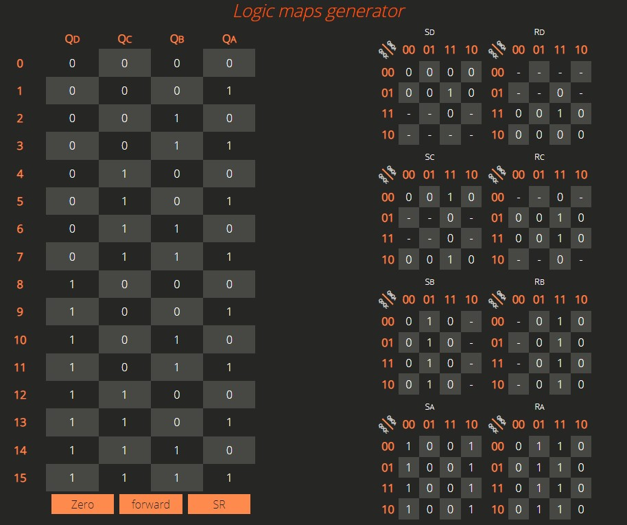

# Counters-logic-maps-generator

## Live demo

[https://logic-maps.herokuapp.com/](https://logic-maps.herokuapp.com/)

## About

Webpage for "basics of computer components" classes. Generator for counter tables from JK / SR / D latches (flip-flops) with direction support. Inspired by [https://www.charlie-coleman.com/experiments/kmap/](https://www.charlie-coleman.com/experiments/kmap/)

